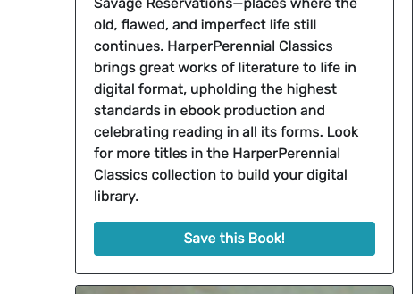

# Google Books Search


## Description
This React project involved refactoring a REST API to work with  Apollo Server and Graphql. The working app allows users to login, search books, and curate a list of saved books.
## Table of Contents
- [Installation](#installation)
- [Usage](#usage)
- [Contributions](#contributions)
- [Testing Information](#testing)
- [License](#license)
- [Questions](#questions)
## Installation
```npm install``` installs all dependencies for the server and client.
## Usage
No usage instructions provided.





## Contributions
[](code_of_conduct.md)

## Testing
To test, run 'npm test -- None'.

## License
This project is covered under a/an MIT license. For more information see GitHub documentation on licensing a project [here](https://docs.github.com/en/communities/setting-up-your-project-for-healthy-contributions/adding-a-license-to-a-repository).

## Questions
​For questions, get in touch on [GitHub](https://github.com/bryan-barnes12/) or email me at [theonlysweetbeebles@gmail.com](mailto:theonlysweetbeebles@gmail.com).
    